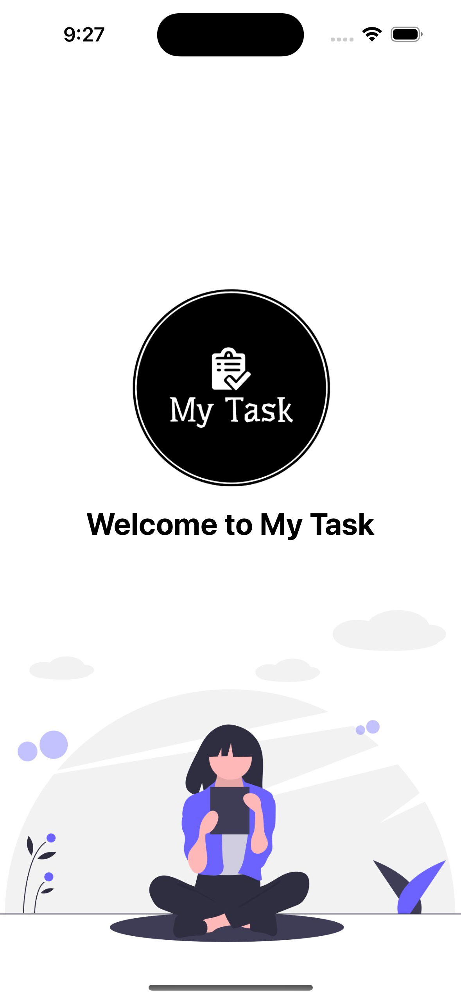
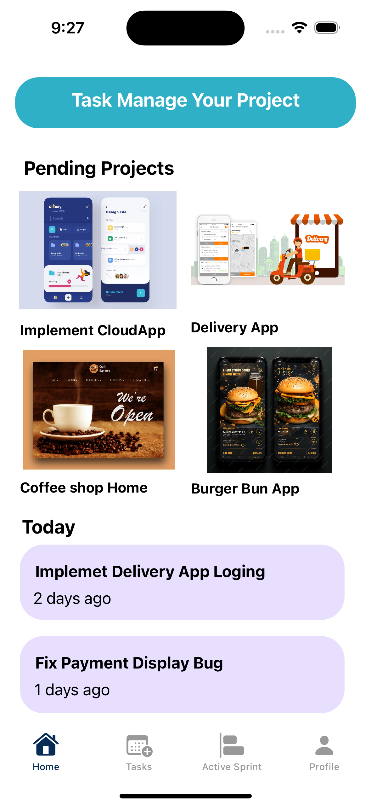
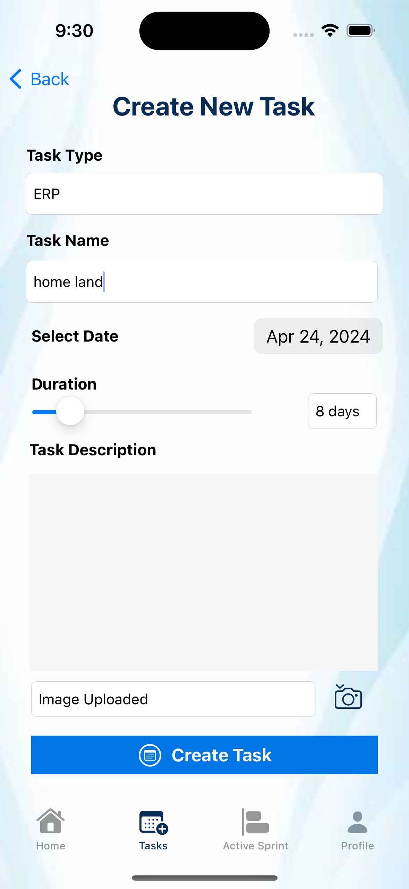
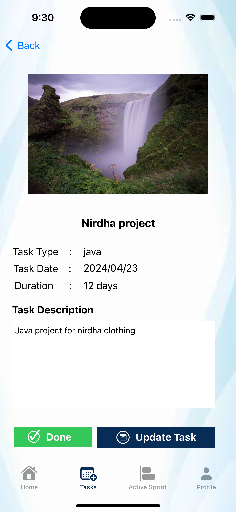
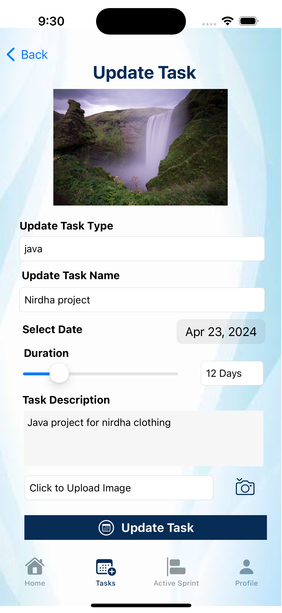
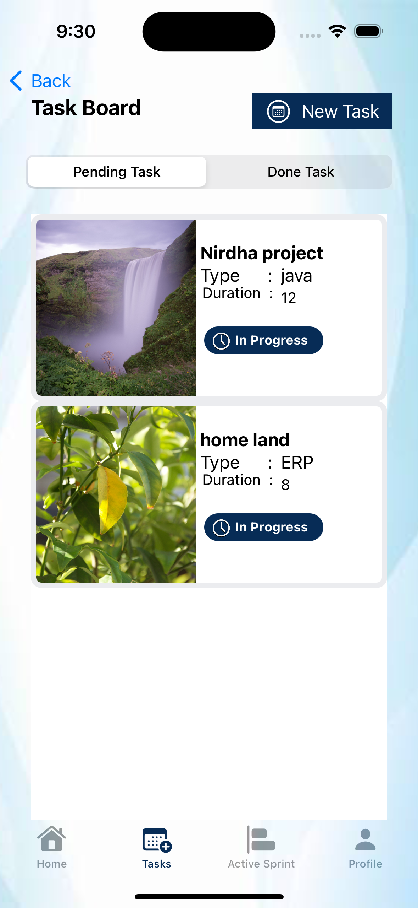
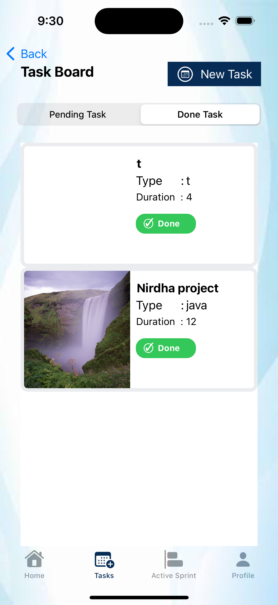

Please go under edit and edit this file as needed for your project.  There is no seperate documentation needed.

# Project Name - Task Management App
# Student Id - IT20668136
# Student Name - HETTIARACHCHI H A T T

#### 01. Brief Description of Project - "My Tasks" is a mobile application aimed at helping users efficiently manage their daily tasks and activities. It offers a user-friendly platform accessible from anywhere at any time. The app categorizes tasks into pending and closed, allowing users to track what needs to be done and what's already completed. Users can add tasks with titles, descriptions, due dates, and priority levels. The app enables editing, marking tasks as done, and deleting tasks as needed, promoting organization and productivity.
#### 02. Users of the System - The target users of "My Tasks" are individuals seeking a convenient and straightforward solution to manage their tasks effectively. This app caters to professionals, students, homemakers, and anyone with a busy schedule who desires a tool to stay organized and on top of their daily activities. It's suitable for both personal and professional use, accommodating various lifestyles and responsibilities.
#### 03. What is unique about your solution -The uniqueness of "My Tasks" lies in its simplicity and user-friendly interface. Unlike complex task management apps, it offers an organized and efficient platform with two distinct task categories—pending and closed. This clear distinction motivates users by providing a visual representation of their progress. Additionally, features like due dates and priority levels facilitate task prioritization, benefiting users with hectic schedules. The app's flexibility allows users to filter and manage tasks according to their preferences, making it adaptable to individual needs. Overall, "My Tasks" stands out for its intuitive design, focusing on user needs and priorities to enhance productivity and reduce stress.
#### 04. Briefly document the functionality of the screens you have (Include screen shots of images)

  
this is main log page for the application

  
this is the home page and we can move on to the task sector 

  
and here we can create a task

  
and we can viwe in this page

 
this is the task update page

  
this is the oending task page

   
this is the task dash bord
..

#### 05. Give examples of best practices used when writing code

import UIKit

class AddTaskViewController: UIViewController, UINavigationControllerDelegate, UIImagePickerControllerDelegate {

    @IBOutlet var taskName: UITextField!
    @IBOutlet var taskType: UITextField!
    @IBOutlet var taskDate: UIDatePicker!
    @IBOutlet var taskDuration: UISlider!
    @IBOutlet var taskDesc: UITextView!
    @IBOutlet var durationLabel: UITextField!
    @IBOutlet var imageStatus: UITextField!
    
    
    var image : UIImage!
    
    override func viewDidLoad() {
        super.viewDidLoad()
        durationLabel.text = "\(Int(taskDuration.value)) days"
        imageStatus.text = "Click to Upload Image"
    }
    
    @IBAction func onChageDuration(_ sender: Any) {
        durationLabel.text = "\(Int(taskDuration.value)) days"
    }
    
    
    @IBAction func selectImage(_ sender: Any) {
        let picker = UIImagePickerController()
        picker.delegate = self
        picker.allowsEditing = true
        picker.sourceType = .photoLibrary
        present(picker, animated: true)

    }
    
    @IBAction func btnSave(_ sender: Any) {
        
        if let name = taskName.text,
           let shortdescription = taskDesc.text,
           let type = taskType.text{
            if name != "" || type != "" {
            let newTask = TaskManageEntity(context: DBManager.share.context)
            newTask.name = name
            newTask.shortdescription = shortdescription
            newTask.type = type
            newTask.taskdate = taskDate.date
            newTask.taskduration = Int16(taskDuration.value)
            newTask.image = image?.jpegData(compressionQuality: 1)
            newTask.taskstatus = false

            DBManager.share.saveContext()
      
            print (newTask)
                
            let alertController = UIAlertController(title: "Success", message: "Task Added Successfully!!!!", preferredStyle: .alert)
                
                let action = UIAlertAction(title: "OK", style: .default){ [self] (action) -> Void in
                    if let vc = storyboard?.instantiateViewController(withIdentifier: "TaskManageViewController") as? TaskManageViewController{
                            self.navigationController?.pushViewController(vc, animated: true)
                    }
                }
                alertController.addAction(action)
                present(alertController, animated: true, completion: nil)
            }
            else{
                let alertController = UIAlertController(title: "Validation Error", message: "Please fill all the fileds", preferredStyle: .alert)

                let action = UIAlertAction(title: "OK", style: .default){ [
                    self] (action) -> Void in
                }

                alertController.addAction(action)
                present(alertController, animated: true, completion: nil)
            }
        }
        else{
            print("Please fill all the field")
        }
    }
        func imagePickerController(_ picker: UIImagePickerController, didFinishPickingMediaWithInfo info: [UIImagePickerController.InfoKey : Any]) {
            guard let userPickedImage = info[.editedImage] as? UIImage else { return
            }
            image = userPickedImage
            if (image != nil) {
                imageStatus.text = "Image Uploaded"
            }else{
                imageStatus.text = "Click to Update Image"
            }
            picker.dismiss(animated: true)
        }
}

* Maintained consistent naming conventions for variables, functions, and actions, improving code readability and maintainability.
* Clear and concise naming conventions are used for outlets, properties, functions, and actions, enhancing code readability.
* he code is divided into separate functions for specific tasks (such as handling image selection and presenting alerts), promoting modularity and code reuse
* roper implementation of the UIImagePickerControllerDelegate protocol follows the delegate pattern, ensuring separation of concerns and modularity.

#### 06. UI Components used

*UIViewController: The AddTaskViewController class inherits from UIViewController, which is the base class for managing view controllers in iOS apps. It provides methods and properties for managing the view hierarchy and responding to user interactions.

*UITextField: UITextField is used to display and edit single-line text input. In the provided code, taskName, taskType, and durationLabel are instances of UITextField used for capturing task name, type, and duration, respectively.

*UITextView: UITextView is used for displaying and editing multiline text content. The taskDesc variable represents a UITextView used for capturing task descriptions.

*UIDatePicker: UIDatePicker is a control used for selecting dates and times. In the code, taskDate is an instance of UIDatePicker used for selecting task due dates.

*UISlider: UISlider is a control used for selecting a value from a continuous range. taskDuration is a UISlider used for selecting the duration of the task.

*UIImagePickerController: UIImagePickerController is a view controller that manages the system interfaces for taking pictures and choosing media from the photo library. It allows users to select images from their device's photo library. The selectImage method presents an instance of UIImagePickerController to enable users to select an image for the task.

*UIAlertController: UIAlertController is a view controller used for presenting alerts to the user. It provides various styles of alerts, such as action sheets and modal dialogs. In the code, UIAlertController is used to display success and validation error messages when saving tasks.

#### 07. Testing carried out

    func testExample()  {
        
        let app = XCUIApplication()
        app.launch()
        app.tabBars["Tab Bar"].buttons["Tasks"].tap()
        
        let tablesQuery = app.tables
        tablesQuery.cells.containing(.staticText, identifier:"Implement this Page").staticTexts["Type      :"].tap()
        app/*@START_MENU_TOKEN@*/.staticTexts["  Update Task"]/*[[".buttons[\"  Update Task\"].staticTexts[\"  Update Task\"]",".staticTexts[\"  Update Task\"]"],[[[-1,1],[-1,0]]],[0]]@END_MENU_TOKEN@*/.tap()
        
        let enterTaskTypeTextField = app.textFields["Enter Task Type"]
        enterTaskTypeTextField.tap()
        app.buttons["  Update Task"].tap()
        
        let backButton = app.navigationBars["TaskManagementApp.SpecificTaskView"].buttons["Back"]
        backButton.tap()
        enterTaskTypeTextField.tap()
        app.navigationBars["TaskManagementApp.EditTaskView"].buttons["Back"].tap()
        backButton.tap()
        tablesQuery/*@START_MENU_TOKEN@*/.cells.containing(.staticText, identifier:"Implement this Page")/*[[".cells.containing(.staticText, identifier:\"Task \")",".cells.containing(.staticText, identifier:\"Implement this Page\")"],[[[-1,1],[-1,0]]],[0]]@END_MENU_TOKEN@*/.staticTexts["Duration  : "].tap()
        
    }

    
    func testLaunchPerformance() throws {
        if #available(macOS 10.15, iOS 13.0, tvOS 13.0, watchOS 7.0, *) {
            // This measures how long it takes to launch your application.
            measure(metrics: [XCTApplicationLaunchMetric()]) {
                XCUIApplication().launch()
            }

#### 08. Documentation 

(a) Design Choices

The "My Tasks" app is designed with simplicity and user-friendliness as primary goals. Its interface is clean and straightforward, allowing users to manage their tasks intuitively. By categorizing tasks into "Pending" and "Closed," users can easily track their progress and stay organized. Offering detailed task information such as titles, descriptions, due dates, and priority levels enhances the app's functionality while maintaining simplicity. The inclusion of filtering options enables users to quickly locate specific tasks based on their status, streamlining task management. Additionally, features like task editing and deletion provide users with flexibility in managing their tasks according to changing requirements or priorities.

(b) Implementation Decisions

Choosing to develop the app for mobile platforms ensures accessibility and convenience for users who rely on smartphones for task management. Cross-platform compatibility ensures that users can access the app seamlessly across different devices, enhancing its reach and usability. Implementing a robust backend infrastructure and user authentication system ensures secure storage and management of user data, prioritizing privacy and data security. Utilizing a database system for data management enables efficient task organization and synchronization across devices. The incorporation of a notification system enhances user productivity by providing timely reminders for upcoming tasks. Thorough testing and quality assurance practices ensure a stable and reliable app experience for users.

(c) Challenges

Achieving a balance between simplicity and functionality poses a challenge in designing the app's user interface to be intuitive yet comprehensive. Ensuring seamless data synchronization across devices while maintaining data integrity requires careful implementation and testing. Addressing security concerns and protecting user data from potential breaches or unauthorized access demands robust security measures and ongoing vigilance. Ensuring consistent performance and user experience across various mobile platforms and devices presents optimization challenges. Managing notifications effectively without overwhelming users with excessive alerts requires thoughtful design and user feedback integration. Additionally, incorporating user feedback to continuously improve the app's features and usability requires active engagement with users and agile development practices.

#### 09. Reflection

*O ne challenge faced in completing the assignment was ensuring the balance between providing sufficient detail and maintaining brevity. It was essential to convey the necessary information about the design choices, implementation decisions, 
* Another challenge was synthesizing the provided code snippet into coherent explanations of design choices and implementation decisions.

  

